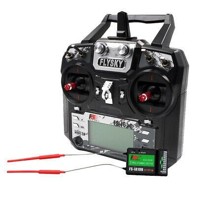

# FlySky FS-i6X + FS-iA6B

> 10 kanal 2.4 GHz RC sistemi. Kumanda FS-i6X, alıcı FS-iA6B. Projede iBUS protokolü ile tek hat üzerinden 14 kanal veri alınır.

| | |
|-|-|
| Kumanda | FS-i6X (10 kanal) |
| Alıcı | FS-iA6B (6 PWM + iBUS) |
| Protokol | iBUS (projede kullanılan) |
| Proje Adedi | 1 kumanda + 1 alıcı |
| Durum | Alındı |

---

## Teknik Özellikler

### Kumanda — FS-i6X

| Parametre | Değer |
|-----------|-------|
| Kanal | 10 (alıcıya göre 6 veya 10) |
| Frekans | 2.4 GHz AFHDS 2A |
| Çıkış protokolü | PPM, iBUS, S.Bus |
| Besleme | 4× AA pil |
| Telemetri | iBUS-sens (opsiyonel geri besleme) |

### Alıcı — FS-iA6B

| Parametre | Değer |
|-----------|-------|
| PWM çıkış | CH1–CH6 |
| iBUS çıkış | **iBUS SERVO** soketinden, 14 kanal tek hat (SENS soketi telemetri sensörleri içindir) |
| Besleme | 4.0–6.5 V |
| Max akım | 100 mA |
| Sinyal voltajı | 3.3 V (ESP32 doğrudan bağlanır) |

---

## Kanal Ataması

| Kanal | İndeks | Fonksiyon | Kumanda Kontrolü |
|-------|--------|-----------|-----------------|
| Kanal | İndeks | Fonksiyon | Kumanda Kontrolü (Mode 2) | Yaylı mı? |
|-------|--------|-----------|---------------------------|-----------|
| CH1 | 0 | **Yaw (dönüş)** | Sağ çubuk yatay | Evet |
| CH2 | 1 | **Gaz (ileri/geri)** | Sağ çubuk dikey | Evet |
| CH3 | 2 | Kullanılmıyor | Sol çubuk dikey | **Hayır** |
| CH4 | 3 | Yedek (alternatif yaw) | Sol çubuk yatay | Evet |
| CH5 | 4 | **Arm switch** | SwA (Aux ataması gerekir) | — |
| CH6 | 5 | Yedek (Faz 4: toplama mekanizması) | VrB | — |

> **Neden CH3 değil?** FS-i6X'in gaz çubuğu (CH3) yaylı değildir: bırakınca ortaya
> dönmez, olduğu yerde kalır. Çift yönlü ESC'de 1500 µs = dur olduğu için bu çubukla
> sürmek, çubuk bırakılınca teknenin gitmeye devam etmesi ve "dur" noktasının elle
> bulunmak zorunda kalınması demektir. Bu yüzden sürüş kendiliğinden ortalanan sağ
> çubuğa alındı: **çubuğu bırakmak = dur.** Mode 1 kumandada da CH1/CH2 yaylıdır,
> kod değişmez (sadece fiziksel taraf değişir).

**Kod referansı:** kanal indeksleri ve yön çevirme `Firmware/src/esp32/include/config.hpp`
(`kChThrottle`, `kChYaw`, `kChArm`, `kThrottleReversed`, `kYawReversed`), kullanım
`Firmware/src/esp32/src/control.cpp`.

**Kumanda ayarları (bir kez yapılır):**
1. Menu → Functions setup → Aux. channels → **Channel 5 = SwA** (varsayılan VrA potudur)
2. Menu → System → RX setup → Output mode → **Serial: i-BUS**
3. Çubuk yönü testi: sağ çubuğu ileri it → ESP32 logunda `gaz=+...` görünmeli; sağa it →
   `yaw=+...`. Ters ise Functions setup → Reverse'den ilgili kanalı çevir
   (veya `config.hpp`'de `kThrottleReversed` / `kYawReversed`).
4. Subtrim / trim sıfır olmalı (çubuk merkezde ≈1500 µs).

---

## iBUS Protokol Detayı

| Parametre | Değer |
|-----------|-------|
| Baud | 115200 |
| Frame uzunluğu | 32 bayt |
| Header | `0x20 0x40` |
| Checksum | `0xFFFF − sum(byte[0..29])` |
| Frame hızı | ~142 Hz (7 ms periyot) |
| Kanal değeri | 1000–2000 (1500 = merkez) |
| Bağlantı | Alıcı iBUS SERVO soketi → ESP32 GPIO16 (UART1 RX) |

---

## Failsafe Yapılandırması

Failsafe ayarlı FS-iA6B sinyal kesilince frame göndermeyi durdurmaz — kanal değerlerini preset'e çeker. Firmware iki şekilde yakalar:

- **Frame yokluğu:** 200 ms geçerli frame gelmezse (kablo koptu, alıcı enerjisiz, failsafe ayarsız alıcı çıkışı kesti) → `FAILSAFE`, motorlar anında durur.
- **Preset değerler:** alıcı frame göndermeye devam ediyorsa CH5 = 1000 µs gelir → `DISARMED`, motorlar anında durur.

Bu yüzden **alıcı failsafe değerleri mutlaka ayarlanmalıdır** (özellikle CH5).

**Adımlar:**
1. Kumanda → Menu → System → RX Setup → Failsafe
2. CH1 (Yaw) = **1500 µs** — sağ çubuk ortada iken ayarla
3. CH2 (Gaz) = **1500 µs** (nötr = dur)
4. CH5 (Arm) = **1000 µs** (disarm) — SwA kapalıyken ayarla
5. Diğer kanallar = merkez
6. Kaydet ve test et (pervaneler güvenli konumdayken): ARM et, hafif gaz ver, kumandayı kapat → ESP32 logda `FAILSAFE` veya `ARMED -> DISARMED` görünmeli ve ESC pulse değerleri nötre dönmeli

---

## Telemetri (iBUS SENS) — Faz 3

ESP32, alıcının **SENS** soketine "sensör" gibi bağlanır; batarya voltajı, PDB sıcaklığı
ve akım kumanda ekranında görünür (Menu → System → Display sensors).

| Parametre | Değer |
|-----------|-------|
| Bağlantı | SENS sinyal pini → ESP32 GPIO15 (UART2, tek tel, open-drain) |
| Protokol | 115200 8N1, half-duplex; alıcı sorgular, ESP32 cevaplar |
| Sensör 1 | Ext.V — batarya voltajı (0.01 V) |
| Sensör 2 | Temp — PDB sıcaklığı |
| Sensör 3 | Akım (tip 0x05) — stok FS-i6X yazılımında görünmeyebilir |

> SENS hattı voltajını bağlamadan önce multimetreyle ölç; 3.3 V'u aşıyorsa
> seviye dönüştürücü kullan. Firmware'de `kTelemetryEnabled = true` yap.

---

## Bind (Eşleştirme) Prosedürü

1. Alıcının **B/VCC** portuna bind plug tak (2 pinli beyaz soket — iBUS SERVO/SENS ile karıştırma)
2. Alıcıya güç ver — LED hızlı yanıp söner
3. Kumanda → Menu → System → RX Bind
4. Kumandayı aç — eşleşme otomatik tamamlanır
5. Bind plug'ı çıkar, alıcıyı yeniden başlat
6. LED sabit yanarsa bağlantı başarılı

---

## Uyarılar

- **Bind sonrası failsafe'i yeniden ayarla** — bind işlemi failsafe'i sıfırlar
- 2.4 GHz ortamda Wi-Fi / BT aktifse menzil azalabilir — saha testinde kontrol et
- Kumanda pili %30'un altındaysa paket kaybı olasılığı artar
- Anten dikey konumda maksimum menzil sağlar
